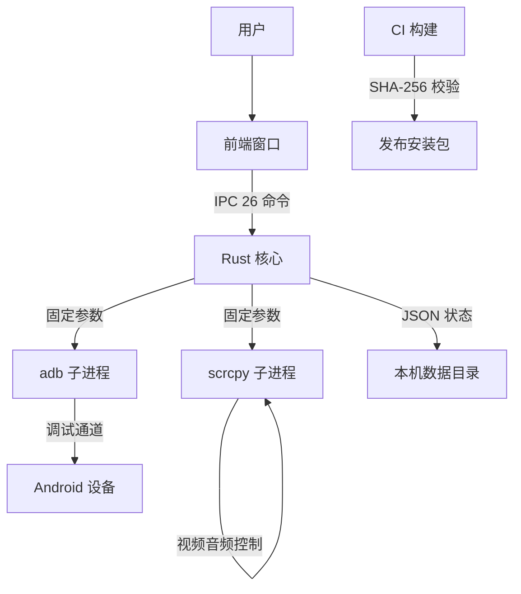

# MirrorDock 威胁模型（R3-03）

> 2026-09-28 首版。按 security-threat-model 方法论产出，仓库取证锚定。**结论为条件性**：文末「待用户确认的假设」未回签前，优先级按保守取值。

## Executive summary

MirrorDock 是本地优先的桌面应用（Tauri 2 + Rust + scrcpy 子进程），无服务器、无账号。最集中的风险面是三条：(1) **adb/scrcpy 子进程边界**——设备端返回的数据（文件名、ls 输出、序列号）与本地用户输入（端点、许可证）是仅有的两类外部输入，工程铁律已用固定参数调用与严格校验覆盖，残余风险集中在「设备返回内容被解析」的路径；(2) **许可证验签**——公钥编译进二进制，签名载荷 JSON 与 base32 自实现格式需防混淆与降级；(3) **供应链**——scrcpy 随包分发依赖 CI 内固定 SHA-256 校验，该校验是唯一完整性屏障。无网络监听、无遥测，远程攻击面极小。

## Scope and assumptions

**In scope**：`src-tauri/`（运行时）、`src/`（前端）、`scripts/`（测试工具，低敏）、`.github/workflows/build.yml`（构建链）、`src-tauri/examples/`（仅内部签发工具）。
**Out of scope**：Android 伴侣 App（C4，未开始）、更新分发基础设施（v1 用手动下载）、官网。

**待用户确认的假设（技能第 7 步降级执行）**：
1. 签发私钥仅存于开发者本机内部目录、永不进 CI——若未来私钥进 CI 签发，TM-006 优先级升至 high。
2. 用户运行环境为本人物理机，恶意局域网攻击者不是默认威胁源——若产品进入企业/公共 WiFi 场景，TM-002/003 升级。
3. 应用不做自动更新下载——若引入，需先补更新链路威胁建模。
4. scrcpy 来源固定为 v4.1 官方包 + 固定哈希——升级流程变更需重评 TM-005。

## System model

### Primary components
- 前端窗口（React，`src/App.tsx`）→ Tauri IPC（26 个命令，`generate_handler!`）
- Rust 核心（`src-tauri/src/lib.rs`）：会话状态机（七态）、DiagnosticsLog（脱敏环形日志）、licensing（R3-01）、最近设备/配对记录（应用数据目录 JSON）
- 子进程：adb、scrcpy（四级查找：env → 开发目录 → 随包资源 → PATH，`select_scrcpy_binary`）
- 设备端：Android 调试授权（USB/TLS），无 MirrorDock 组件
- 构建链：CI 下载 scrcpy 官方包并按固定 SHA-256 校验（`build.yml`）

### Data flows and trust boundaries
- 设备 → adb/scrcpy 子进程：文件名、ls 输出、能力探测属性（**设备可影响**，通道 adb 本地/TLS）；保证：固定参数调用、序列号白名单校验（`validate_serial`）、文件名 ASCII 白名单。
- 用户 → 前端 → IPC：许可证串、端点、配对码；保证：`capabilities/default.json` 仅 `core:default/opener:default/dialog:default`——前端无 fs/shell 插件能力，文件系统访问只能经后端命令。
- 后端 → 应用数据目录：entitlement.json、recent-devices、trusted-wireless（本机用户可读写=可信边界内，但被篡改时须安全降级：许可证损坏回退免费版，有测试）。
- CI → 发布产物：scrcpy 包哈希校验（固定写死）+ SHA256SUMS 元数据。

## Assets and security objectives

| 资产 | 重要性 | 目标 |
| --- | --- | --- |
| 屏幕画面/音频流（会话中） | 用户最高敏感数据 | 机密性：不落日志、不出本机 |
| 剪贴板内容 | 双向同步途径 | 机密性：不进 MirrorDock 进程外 |
| 配对码/端点/序列号 | 可重放接入凭证 | 机密性：诊断包脱敏（有测试） |
| 许可证签发私钥 | 商业完整性 | 绝不入仓库/CI/日志 |
| entitlement.json | 权益完整性 | 篡改/损坏 → 安全回退免费版（有测试） |
| scrcpy 二进制 | 执行完整性 | 固定哈希 + 来源记录 |
| 本机文件（用户目录） | 完整性 | 只在用户对话框选定路径写 |

## Attacker model

**Capabilities**：同局域网攻击者（可扫描 mDNS、伪造设备响应的对手属高配置场景，默认不假设）；被镜像设备上的恶意 App（受 FLAG_SECURE/捕获策略约束，这是平台边界不是 MirrorDock 边界）；本机恶意软件（与 MirrorDock 同权限，超出本模型——它已可直接读屏幕）。
**Non-capabilities**：无远程可达端口（应用不监听；adb forward 由 scrcpy 按需创建且仅 localhost）；无服务端；攻击者不能通过任何渠道在未握有设备授权的情况下触达镜像数据。

## Entry points and attack surfaces

| Surface | How reached | Trust boundary | Evidence |
| --- | --- | --- | --- |
| Tauri IPC 26 命令 | 前端（窗口内脚本被攻破时） | 渲染进程 → 核心 | `generate_handler!` + `capabilities/default.json` |
| 设备返回数据（文件名/ls/getprop/dumpsys） | adb 输出解析 | 设备 → 核心 | `send_file_to_device`、`probe_device_capabilities` |
| 许可证串 | 用户粘贴 | 用户 → 验签 | `licensing::verify_license` |
| 无线端点/配对码 | 用户输入 | 用户 → adb | `pair_wireless_device`/`connect_wireless_device` |
| scrcpy 二进制来源 | 环境变量/开发目录/随包/PATH | 文件系统 → 进程执行 | `select_scrcpy_binary` |
| CI scrcpy 下载 | 构建时外网 | Internet → 产物 | `build.yml` 固定哈希 |

## Top abuse paths

1. **恶意设备文件名注入**：设备端文件名含 `../`/控制字符 → 传输回执显示伪造路径（低危：只显示；后端文件名白名单已挡注入系统路径）。
2. **许可证降级/混淆**：构造多义 base32 或非规范 JSON 绕过 `edition=="pro"` 判断 → 白嫖 Pro。影响：商业完整性，非安全。
3. **诊断包泄露敏感信息**：脱敏遗漏新调用点 → 用户主动导出后泄露序列号/端点。已有双保险机制+测试，新命令是主要风险窗口。
4. **PATH 替换 scrcpy/adb**：本机恶意软件预置 PATH → 执行任意代码。属「本机已失陷」场景（非能力），但发行模式下四级查找回退 PATH 的顺序需在文档中明示。
5. **CI 供应链**：GitHub Actions 缓存投毒/官方包 URL 被替换 → 固定哈希校验失败即断链（fail-closed），残余风险是哈希值本身被 PR 篡改（需 review 防线）。
6. **签发私钥泄露**：examples/license_sign 读 env；种子文件在开发机明文存放 → 泄露可签发永久 Pro。缓解：文件权限、不在 CI、可轮换 key_id。
7. **IPC 面滥用**：窗口 XSS（React 转义+无危险 HTML 注入点）+ 插件能力最小化；dialog:default 仅限文件选择。
8. **运行中设备数据回放**：录制 MP4 明文存用户目录 → 本地威胁模型内（与屏幕同权），文档明示「录制内容未加密」。

## Threat model table（节选高优先级）

| ID | 威胁 | 前提 | 影响 | 现有控制（证据） | 缺口 | 缓解建议 | 可能性 | 影响 | 优先级 |
| --- | --- | --- | --- | --- | --- | --- | --- | --- | --- |
| TM-001 | 设备返回文件名/属性注入欺骗 UI 或解析崩溃 | 用户连上恶意/被劫持设备 | 低-中：UI 欺骗、路径混淆 | 序列号校验、文件名 ASCII 白名单（`validate_serial` 等） | ls 输出解析的健壮性无 fuzz | 对设备字符串解析加 property 测试 | low | medium | **low** |
| TM-002 | 同局域网 MITM 嗅探镜像流 | 公共 WiFi + 无线调试 + 已配对 | 高（画面泄露） | adb TLS（配对后）；产品定位「自己的手机、自己的电脑」 | 公共网络场景未在 UI 警示 | 无线镜像时若非私有网段给出提示 | low | high | **medium** |
| TM-003 | 录像/截图明文落盘被第三方读取 | 本机多用户/失窃 | 中 | 文件在用户私有目录；权限继承系统默认 | Windows 下目录 ACL 未显式收紧 | 录像创建时显式设置仅当前用户可读（Windows） | medium | medium | **medium** |
| TM-004 | 诊断包脱敏遗漏 | 新增命令忘记声明机密 | 中 | 双保险+测试（`recorded_events_never_contain_declared_secrets`） | 机制靠调用点自觉 | 命令模板/代码评审清单固定项 | low | medium | **low** |
| TM-005 | scrcpy 供应链替换 | CI 或本机哈希校验被绕过 | high | CI 固定 SHA-256（fail-closed）、THIRD_PARTY_NOTICES 记录 | 开发模式 PATH 回退；哈希变更评审依赖人工 | PR 模板加「改哈希需附上游 release 公告」检查项 | low | high | **medium** |
| TM-006 | 签发私钥泄露 | 开发机失窃/误提交 | 商业损失 | 种子在仓库外内部目录、不进 CI（假设 1） | 无轮换流程文档 | 文档化 key_id 轮换与吊销（版本号+过期字段已具备） | low | medium | **low** |
| TM-007 | entitlement.json 篡改提权 | 本机用户手改 | 商业完整性 | 加载重验签，损坏回退 Free（测试） | 无防拷贝到其他机器的机器绑定 | 可选：绑定机器指纹（非安全边界，仅提高门槛） | medium | low | **low** |

## Criticality calibration（本仓库语境）

- **critical**：预认证远程代码执行 / 镜像数据离开本机——本架构下无此类面。
- **high**：会话数据被非用户方获取（TM-002）、scrcpy 执行完整性失守（TM-005 触发条件成立时）。
- **medium**：授权凭证（序列号/端点/配对码）经诊断包或 UI 泄露。
- **low**：商业功能（Pro）被绕过、UI 显示级欺骗。

## Focus paths for security review

| 路径 | 原因 | TM |
| --- | --- | --- |
| src-tauri/src/lib.rs（设备输出解析段） | 唯一直接解析外部数据的位置 | TM-001 |
| src-tauri/src/lib.rs `mod licensing` | 新增密码学格式（自实现 base32/长度前缀） | TM-002 的 2/6/7 |
| .github/workflows/build.yml | 供应链哈希与制品发布 | TM-005 |
| src-tauri/capabilities/default.json | IPC 能力最小化的守门 | TM-007 之外的 IPC 面 |
| scripts/failure-injection.sh、perf-gate.sh | 真机测试工具接触设备状态（低敏） | 次要 |

## 依赖漏洞扫描与 SBOM 状态

- cargo-audit：本轮安装并执行（结果见 DEVELOPMENT_TASKS.md 当日记录）；未发现高危时也要把「空结果 + 扫描日期」写入发布检查单。
- SBOM/NOTICE：A1-08 已随产物发布（SHA256SUMS + 依赖清单 -meta）；LICENSE 已定为 Apache-2.0（与 scrcpy 兼容）。
- 更新链路：v1 手动下载——更新相关的签名校验设计为 R3-03 后续项（open）。

## 待用户确认的假设（影响优先级，见 Scope）

1. 签发私钥永不进 CI；2. 产品不面向公共 WiFi 场景作默认承诺；3. v1 无自动更新；4. scrcpy 升级流程保持固定哈希 fail-closed。
